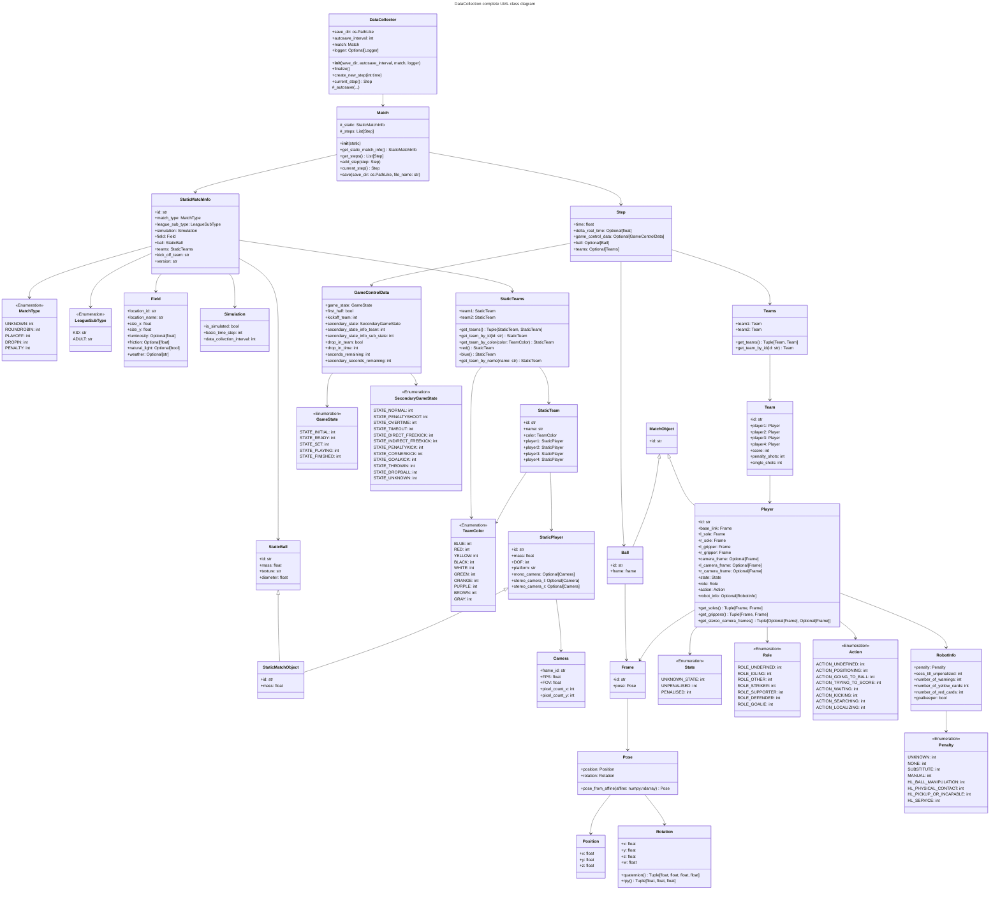
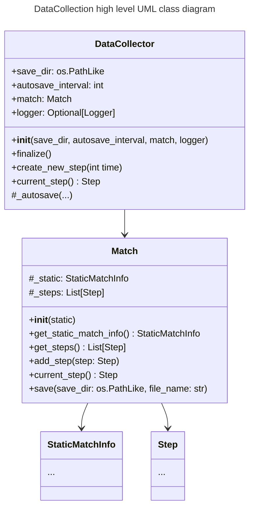
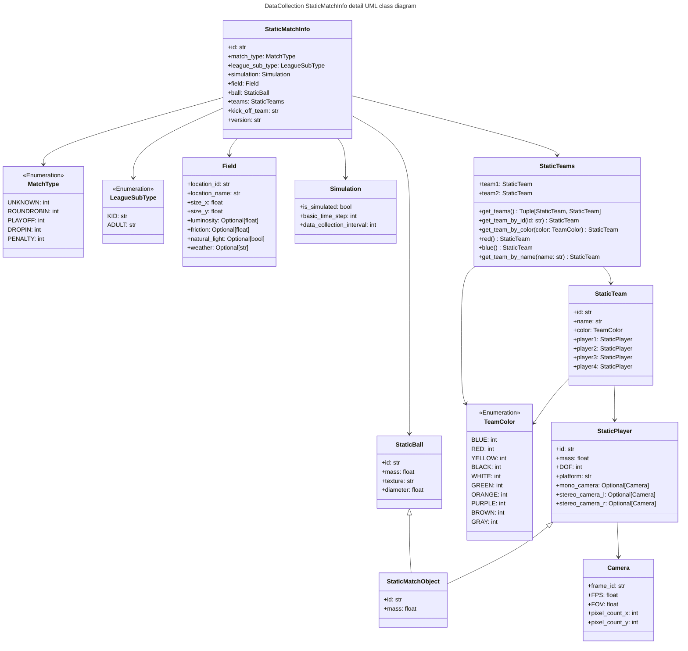
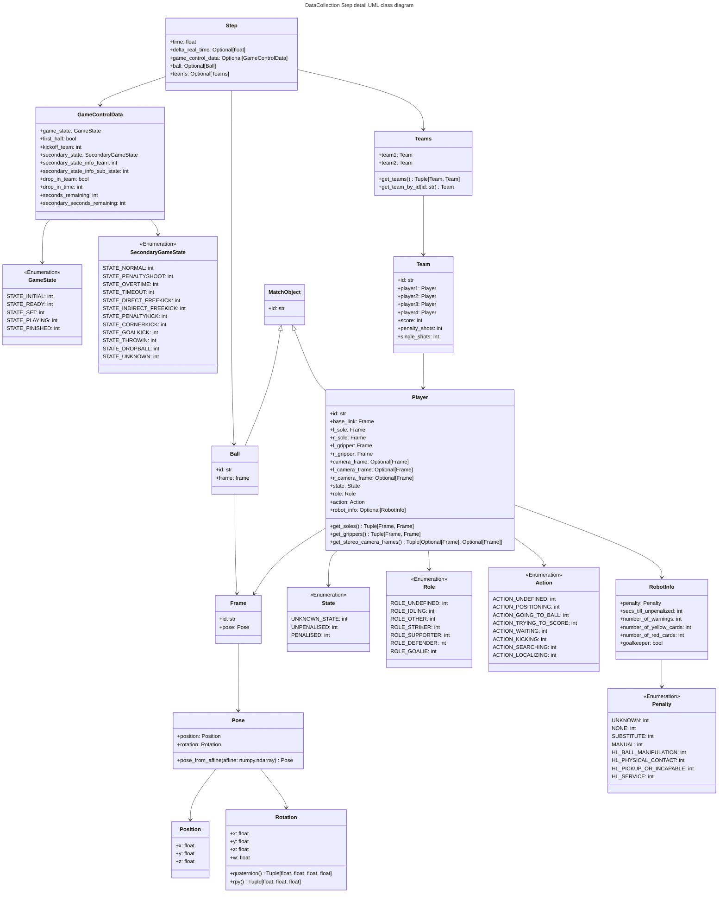

# Data Collection

## Data Structure

```mermaid
---
title: DataCollection complete UML class diagram
---
classDiagram
    class DataCollector {
        +save_dir: os.PathLike
        +autosave_interval: int
        +match: Match
        +logger: Optional[Logger]
        +__init__(save_dir, autosave_interval, match, logger)
        +finalize()
        +create_new_step(int time)
        +current_step() Step
        #_autosave(...)
    }

    class Match {
        #_static: StaticMatchInfo
        #_steps: List[Step]
        +__init__(static)
        +get_static_match_info() StaticMatchInfo
        +get_steps() List[Step]
        +add_step(step: Step)
        +current_step() Step
        +save(save_dir: os.PathLike, file_name: str)
    }

    class StaticMatchInfo {
        +id: str
        +match_type: MatchType
        +league_sub_type: LeagueSubType
        +simulation: Simulation
        +field: Field
        +ball: StaticBall
        +teams: StaticTeams
        +kick_off_team: str
        +version: str
    }

    class MatchType {
        <<Enumeration>>
        UNKNOWN: int
        ROUNDROBIN: int
        PLAYOFF: int
        DROPIN: int
        PENALTY: int
    }

    class LeagueSubType {
        <<Enumeration>>
        KID: str
        ADULT: str
    }

    class StaticBall {
        +id: str
        +mass: float
        +texture: str
        +diameter: float
    }

    class Field {
        +location_id: str
        +location_name: str
        +size_x: float
        +size_y: float
        +luminosity: Optional[float]
        +friction: Optional[float]
        +natural_light: Optional[bool]
        +weather: Optional[str]
    }

    class Simulation {
        +is_simulated: bool
        +basic_time_step: int
        +data_collection_interval: int
    }

    class StaticTeams {
        +team1: StaticTeam
        +team2: StaticTeam
        +get_teams() Tuple[StaticTeam, StaticTeam]
        +get_team_by_id(id: str) StaticTeam
        +get_team_by_color(color: TeamColor) StaticTeam
        +red() StaticTeam
        +blue() StaticTeam
        +get_team_by_name(name: str) StaticTeam
    }

    class StaticTeam {
        +id: str
        +name: str
        +color: TeamColor
        +player1: StaticPlayer
        +player2: StaticPlayer
        +player3: StaticPlayer
        +player4: StaticPlayer
    }

    class TeamColor {
        <<Enumeration>>
        BLUE: int
        RED: int
        YELLOW: int
        BLACK: int
        WHITE: int
        GREEN: int
        ORANGE: int
        PURPLE: int
        BROWN: int
        GRAY: int
    }

    class StaticMatchObject {
        +id: str
        +mass: float
    }

    class StaticPlayer {
        +id: str
        +mass: float
        +DOF: int
        +platform: str
        +mono_camera: Optional[Camera]
        +stereo_camera_l: Optional[Camera]
        +stereo_camera_r: Optional[Camera]
    }

    class Camera {
        +frame_id: str
        +FPS: float
        +FOV: float
        +pixel_count_x: int
        +pixel_count_y: int
    }

    class Step {
        +time: float
        +delta_real_time: Optional[float]
        +game_control_data: Optional[GameControlData]
        +ball: Optional[Ball]
        +teams: Optional[Teams]
    }

    class GameControlData {
        +game_state: GameState
        +first_half: bool
        +kickoff_team: int
        +secondary_state: SecondaryGameState
        +secondary_state_info_team: int
        +secondary_state_info_sub_state: int
        +drop_in_team: bool
        +drop_in_time: int
        +seconds_remaining: int
        +secondary_seconds_remaining: int
    }

    class GameState {
        <<Enumeration>>
        STATE_INITIAL: int
        STATE_READY: int
        STATE_SET: int
        STATE_PLAYING: int
        STATE_FINISHED: int
    }

    class SecondaryGameState {
        <<Enumeration>>
        STATE_NORMAL: int
        STATE_PENALTYSHOOT: int
        STATE_OVERTIME: int
        STATE_TIMEOUT: int
        STATE_DIRECT_FREEKICK: int
        STATE_INDIRECT_FREEKICK: int
        STATE_PENALTYKICK: int
        STATE_CORNERKICK: int
        STATE_GOALKICK: int
        STATE_THROWIN: int
        STATE_DROPBALL: int
        STATE_UNKNOWN: int
    }

    class MatchObject {
        +id: str
    }

    class Ball {
        +id: str
        +frame: frame
    }

    class Frame {
        +id: str
        +pose: Pose
    }

    class Pose {
        +position: Position
        +rotation: Rotation
        +pose_from_affine(affine: numpy.ndarray) Pose
    }

    class Position {
        +x: float
        +y: float
        +z: float
    }

    class Rotation {
        +x: float
        +y: float
        +z: float
        +w: float
        +quaternion() Tuple[float, float, float, float]
        +rpy() Tuple[float, float, float]
    }

    class Teams {
        +team1: Team
        +team2: Team
        +get_teams() Tuple[Team, Team]
        +get_team_by_id(id: str) Team
    }

    class Team {
        +id: str
        +player1: Player
        +player2: Player
        +player3: Player
        +player4: Player
        +score: int
        +penalty_shots: int
        +single_shots: int
    }

    class Player {
        +id: str
        +base_link: Frame
        +l_sole: Frame
        +r_sole: Frame
        +l_gripper: Frame
        +r_gripper: Frame
        +camera_frame: Optional[Frame]
        +l_camera_frame: Optional[Frame]
        +r_camera_frame: Optional[Frame]
        +state: State
        +role: Role
        +action: Action
        +robot_info: Optional[RobotInfo]
        +get_soles() Tuple[Frame, Frame]
        +get_grippers() Tuple[Frame, Frame]
        +get_stereo_camera_frames() Tuple[Optional[Frame], Optional[Frame]]
    }

    class State {
        <<Enumeration>>
        UNKNOWN_STATE: int
        UNPENALISED: int
        PENALISED: int
    }

    class Role {
        <<Enumeration>>
        ROLE_UNDEFINED: int
        ROLE_IDLING: int
        ROLE_OTHER: int
        ROLE_STRIKER: int
        ROLE_SUPPORTER: int
        ROLE_DEFENDER: int
        ROLE_GOALIE: int
    }

    class Action {
        <<Enumeration>>
        ACTION_UNDEFINED: int
        ACTION_POSITIONING: int
        ACTION_GOING_TO_BALL: int
        ACTION_TRYING_TO_SCORE: int
        ACTION_WAITING: int
        ACTION_KICKING: int
        ACTION_SEARCHING: int
        ACTION_LOCALIZING: int
    }

    class RobotInfo {
        +penalty: Penalty
        +secs_till_unpenalized: int
        +number_of_warnings: int
        +number_of_yellow_cards: int
        +number_of_red_cards: int
        +goalkeeper: bool
    }

    class Penalty {
        <<Enumeration>>
        UNKNOWN: int
        NONE: int
        SUBSTITUTE: int
        MANUAL: int
        HL_BALL_MANIPULATION: int
        HL_PHYSICAL_CONTACT: int
        HL_PICKUP_OR_INCAPABLE: int
        HL_SERVICE: int
    }

DataCollector --> Match
Match --> StaticMatchInfo
Match --> Step
StaticMatchInfo --> MatchType
StaticMatchInfo --> LeagueSubType
StaticMatchInfo --> Simulation
StaticMatchInfo --> Field
StaticMatchInfo --> StaticBall
StaticMatchInfo --> StaticTeams
StaticBall <|-- StaticMatchObject
StaticPlayer <|-- StaticMatchObject
StaticTeams --> StaticTeam
StaticTeams --> TeamColor
StaticTeam --> TeamColor
StaticTeam --> StaticPlayer
StaticPlayer --> Camera
Step --> GameControlData
Step --> Ball
Step --> Teams
GameControlData --> GameState
GameControlData --> SecondaryGameState
MatchObject <|-- Ball
MatchObject <|-- Player
Ball --> Frame
Frame --> Pose
Pose --> Position
Pose --> Rotation
Teams --> Team
Team --> Player
Player --> Frame
Player --> State
Player --> Role
Player --> Action
Player --> RobotInfo
RobotInfo --> Penalty
```

```mermaid
---
title: DataCollection high level UML class diagram
---
classDiagram
    class DataCollector {
        +save_dir: os.PathLike
        +autosave_interval: int
        +match: Match
        +logger: Optional[Logger]
        +__init__(save_dir, autosave_interval, match, logger)
        +finalize()
        +create_new_step(int time)
        +current_step() Step
        #_autosave(...)
    }

    class Match {
        #_static: StaticMatchInfo
        #_steps: List[Step]
        +__init__(static)
        +get_static_match_info() StaticMatchInfo
        +get_steps() List[Step]
        +add_step(step: Step)
        +current_step() Step
        +save(save_dir: os.PathLike, file_name: str)
    }

    class StaticMatchInfo {
        ...
    }

    class Step {
        ...
    }

DataCollector --> Match
Match --> StaticMatchInfo
Match --> Step
```

```mermaid
---
title: DataCollection StaticMatchInfo detail UML class diagram
---
classDiagram
    class StaticMatchInfo {
        +id: str
        +match_type: MatchType
        +league_sub_type: LeagueSubType
        +simulation: Simulation
        +field: Field
        +ball: StaticBall
        +teams: StaticTeams
        +kick_off_team: str
        +version: str
    }

    class MatchType {
        <<Enumeration>>
        UNKNOWN: int
        ROUNDROBIN: int
        PLAYOFF: int
        DROPIN: int
        PENALTY: int
    }

    class LeagueSubType {
        <<Enumeration>>
        KID: str
        ADULT: str
    }

    class StaticBall {
        +id: str
        +mass: float
        +texture: str
        +diameter: float
    }

    class Field {
        +location_id: str
        +location_name: str
        +size_x: float
        +size_y: float
        +luminosity: Optional[float]
        +friction: Optional[float]
        +natural_light: Optional[bool]
        +weather: Optional[str]
    }

    class Simulation {
        +is_simulated: bool
        +basic_time_step: int
        +data_collection_interval: int
    }

    class StaticTeams {
        +team1: StaticTeam
        +team2: StaticTeam
        +get_teams() Tuple[StaticTeam, StaticTeam]
        +get_team_by_id(id: str) StaticTeam
        +get_team_by_color(color: TeamColor) StaticTeam
        +red() StaticTeam
        +blue() StaticTeam
        +get_team_by_name(name: str) StaticTeam
    }

    class StaticTeam {
        +id: str
        +name: str
        +color: TeamColor
        +player1: StaticPlayer
        +player2: StaticPlayer
        +player3: StaticPlayer
        +player4: StaticPlayer
    }

    class TeamColor {
        <<Enumeration>>
        BLUE: int
        RED: int
        YELLOW: int
        BLACK: int
        WHITE: int
        GREEN: int
        ORANGE: int
        PURPLE: int
        BROWN: int
        GRAY: int
    }

    class StaticMatchObject {
        +id: str
        +mass: float
    }

    class StaticPlayer {
        +id: str
        +mass: float
        +DOF: int
        +platform: str
        +mono_camera: Optional[Camera]
        +stereo_camera_l: Optional[Camera]
        +stereo_camera_r: Optional[Camera]
    }

    class Camera {
        +frame_id: str
        +FPS: float
        +FOV: float
        +pixel_count_x: int
        +pixel_count_y: int
    }

StaticMatchInfo --> MatchType
StaticMatchInfo --> LeagueSubType
StaticMatchInfo --> Simulation
StaticMatchInfo --> Field
StaticMatchInfo --> StaticBall
StaticMatchInfo --> StaticTeams
StaticBall <|-- StaticMatchObject
StaticPlayer <|-- StaticMatchObject
StaticTeams --> StaticTeam
StaticTeams --> TeamColor
StaticTeam --> TeamColor
StaticTeam --> StaticPlayer
StaticPlayer --> Camera
```

```mermaid
---
title: DataCollection Step detail UML class diagram
---
classDiagram
    class Step {
        +time: float
        +delta_real_time: Optional[float]
        +game_control_data: Optional[GameControlData]
        +ball: Optional[Ball]
        +teams: Optional[Teams]
    }

    class GameControlData {
        +game_state: GameState
        +first_half: bool
        +kickoff_team: int
        +secondary_state: SecondaryGameState
        +secondary_state_info_team: int
        +secondary_state_info_sub_state: int
        +drop_in_team: bool
        +drop_in_time: int
        +seconds_remaining: int
        +secondary_seconds_remaining: int
    }

    class GameState {
        <<Enumeration>>
        STATE_INITIAL: int
        STATE_READY: int
        STATE_SET: int
        STATE_PLAYING: int
        STATE_FINISHED: int
    }

    class SecondaryGameState {
        <<Enumeration>>
        STATE_NORMAL: int
        STATE_PENALTYSHOOT: int
        STATE_OVERTIME: int
        STATE_TIMEOUT: int
        STATE_DIRECT_FREEKICK: int
        STATE_INDIRECT_FREEKICK: int
        STATE_PENALTYKICK: int
        STATE_CORNERKICK: int
        STATE_GOALKICK: int
        STATE_THROWIN: int
        STATE_DROPBALL: int
        STATE_UNKNOWN: int
    }

    class MatchObject {
        +id: str
    }

    class Ball {
        +id: str
        +frame: frame
    }

    class Frame {
        +id: str
        +pose: Pose
    }

    class Pose {
        +position: Position
        +rotation: Rotation
        +pose_from_affine(affine: numpy.ndarray) Pose
    }

    class Position {
        +x: float
        +y: float
        +z: float
    }

    class Rotation {
        +x: float
        +y: float
        +z: float
        +w: float
        +quaternion() Tuple[float, float, float, float]
        +rpy() Tuple[float, float, float]
    }

    class Teams {
        +team1: Team
        +team2: Team
        +get_teams() Tuple[Team, Team]
        +get_team_by_id(id: str) Team
    }

    class Team {
        +id: str
        +player1: Player
        +player2: Player
        +player3: Player
        +player4: Player
        +score: int
        +penalty_shots: int
        +single_shots: int
    }

    class Player {
        +id: str
        +base_link: Frame
        +l_sole: Frame
        +r_sole: Frame
        +l_gripper: Frame
        +r_gripper: Frame
        +camera_frame: Optional[Frame]
        +l_camera_frame: Optional[Frame]
        +r_camera_frame: Optional[Frame]
        +state: State
        +role: Role
        +action: Action
        +robot_info: Optional[RobotInfo]
        +get_soles() Tuple[Frame, Frame]
        +get_grippers() Tuple[Frame, Frame]
        +get_stereo_camera_frames() Tuple[Optional[Frame], Optional[Frame]]
    }

    class State {
        <<Enumeration>>
        UNKNOWN_STATE: int
        UNPENALISED: int
        PENALISED: int
    }

    class Role {
        <<Enumeration>>
        ROLE_UNDEFINED: int
        ROLE_IDLING: int
        ROLE_OTHER: int
        ROLE_STRIKER: int
        ROLE_SUPPORTER: int
        ROLE_DEFENDER: int
        ROLE_GOALIE: int
    }

    class Action {
        <<Enumeration>>
        ACTION_UNDEFINED: int
        ACTION_POSITIONING: int
        ACTION_GOING_TO_BALL: int
        ACTION_TRYING_TO_SCORE: int
        ACTION_WAITING: int
        ACTION_KICKING: int
        ACTION_SEARCHING: int
        ACTION_LOCALIZING: int
    }

    class RobotInfo {
        +penalty: Penalty
        +secs_till_unpenalized: int
        +number_of_warnings: int
        +number_of_yellow_cards: int
        +number_of_red_cards: int
        +goalkeeper: bool
    }

    class Penalty {
        <<Enumeration>>
        UNKNOWN: int
        NONE: int
        SUBSTITUTE: int
        MANUAL: int
        HL_BALL_MANIPULATION: int
        HL_PHYSICAL_CONTACT: int
        HL_PICKUP_OR_INCAPABLE: int
        HL_SERVICE: int
    }

Step --> GameControlData
Step --> Ball
Step --> Teams
GameControlData --> GameState
GameControlData --> SecondaryGameState
MatchObject <|-- Ball
MatchObject <|-- Player
Ball --> Frame
Frame --> Pose
Pose --> Position
Pose --> Rotation
Teams --> Team
Team --> Player
Player --> Frame
Player --> State
Player --> Role
Player --> Action
Player --> RobotInfo
RobotInfo --> Penalty
```
